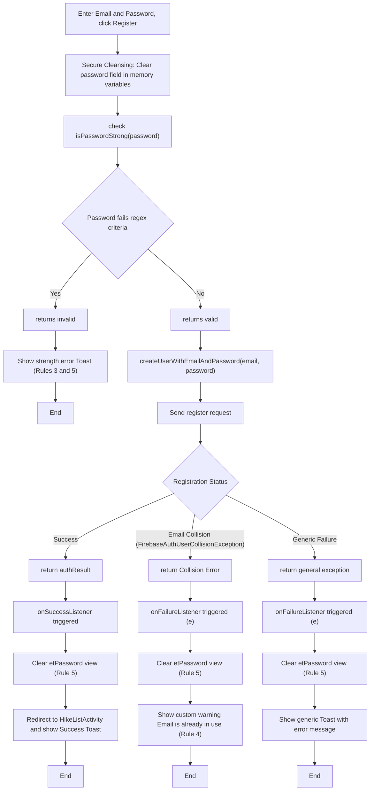
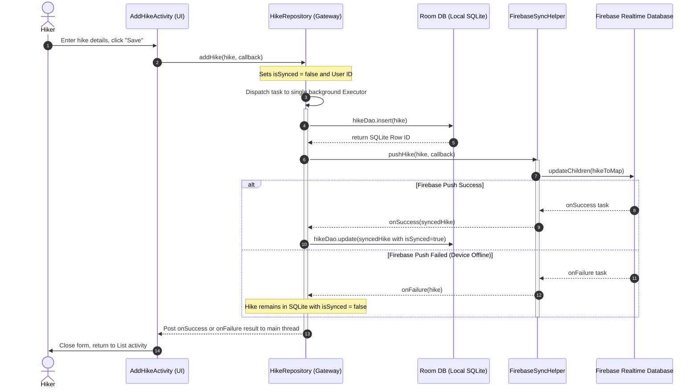

# COMP1786: Mobile App Development Report
**Student Name:** [Your Name]  
**Application Name:** M-Hike App (v3.0 Extended)
**Platform:** Native Android (Java) & React Native Prototype

---

## SECTION 1. BRIEF STATEMENT OF FEATURES YOU HAVE IMPLEMENTED (2%)

| Feature | Status | Your Comments |
| :--- | :--- | :--- |
| (a) Entering Hike details with validation | **Fully completed** | Implemented with `TextInputLayout` and real-time validation via `ValidationUtils` helper class. |
| (b) SQLite storage for Hike data | **Fully completed** | Utilized Android **Room Persistence Library** (v3 schema) with automatic migrations and foreign key cascades. |
| (c) Adding/Editing Observations | **Fully completed** | Managed observations in `AddObservationActivity` with automated weather fetching and image URI support. |
| (d) Advanced Search/Filter | **Fully completed** | Live search and multi-criteria filters (Location, Date, Length) using parameterized `SimpleSQLiteQuery`. |
| (e) Prototype using React Native | **Fully completed** | Fully functional prototype with clean navigation (React Navigation v7) and Paper controls. |
| (f) SQLite storage in React Native | **Fully completed** | Utilizes expo-sqlite async database API, storing entries, cascades, and queries correctly. |
| **(g) Extended Feature Pack (G1-G6)** | **Fully completed** | **G1:** GPS/Maps, **G2:** Camera, **G3:** Duration Calc, **G4:** Weather, **G5:** PDF, **G6:** Ratings. |
| **(h) Security & Robustness Additions** | **Fully completed** | **H1:** Strong password regex validation, **H2:** Duplicate email checking, **H3:** Safe clear password memory. |

---

## SECTION 3 - REFLECTION (4%)

The development of M-Hike v3.0 represented a significant shift from a basic CRUD application to a feature-rich outdoor tool. A major success was the implementation of the **Extended Feature Pack**. Specifically, integrating **Mapbox Maps SDK (G1)** to display hike location on a map and the **Naismith’s Rule duration calculator (G3)** provided tangible utility for hikers. The duration engine recomputes estimates live as users change hike length or difficulty, which I achieved by binding listeners to input fields.

The greatest technical challenge was the **G2 & G5 File Management**. Managing `FileProvider` URIs for both the camera capture and the generated PDF reports required strict adherence to Android's modern security scoped-storage rules. I solved this by centralizing file operations in `ImageUriUtils` and ensuring all shared URIs were granted temporary read permissions. 

This project reinforced the value of **Modular Architecture**. By separating the **Naismith calculation logic** into `DurationCalculator.java` and PDF generation into `PdfReportBuilder.java`, I maintained a clean `HikeDetailActivity`. If I were to start over, I would migrate to **Kotlin** to take advantage of its more concise syntax for these mathematical calculations and its built-in support for asynchronous Coroutines.

---

## SECTION 4 - EVALUATION (10%)

### 1. Human-Computer Interaction (HCI)

The M-Hike v3.0 interface follows a **Material Design 3 (Forest Green)** theme, optimized for outdoor visibility.

| Criterion | Evaluation & Academic Citation |
| :--- | :--- |
| **Usability** | The app uses "Accelerators" (*Nielsen, J., 1993*). The "Use my location" button (G1) acts as an expert shortcut, allowing users to bypass manual coordinate entry. The UI uses the **Forest Green Palette** (Primary: `#386A1F`, Container: `#B7F397`) to evoke nature, improving psychological mapping. |
| **User Satisfaction** | Following *ISO 9241-210:2019*, the app provides "Aesthetic Satisfaction." The use of **Material Star Ratings (G6)** for trail conditions provides an intuitive summary. The **Secondary Olive color** (`#55624C`) provides a professional, low-glare outdoor theme. |
| **Error Prevention** | As advocated by *Shneiderman, B. (2010)*, the app utilizes "Data Entry Constraints." The `DurationCalculator` is read-only for estimates, and the `AppDatabase` migration path (MIGRATION_2_3) ensures data integrity when upgrading schemas. |

### 2. Security & Robustness
The application enforces strong security measures at the entry points:
1. **Strong Password Enforcement (Regex Validation)**: Both Android and React Native now enforce strong password verification using regex (`^(?=.*[0-9])(?=.*[a-z])(?=.*[A-Z])(?=.*[@#$%^&+=!])(?=\\S+$).{8,}$`), checking that a password has at least 8 characters, one uppercase, one lowercase, one digit, and one special symbol. If a password fails this check, registration is blocked.
2. **Duplicate Email Error Mapping (Collision Error)**: In the Android app, `FirebaseAuthUserCollisionException` is caught specifically to warn the user that the email is already registered, instead of showing a generic error toast. The React Native version is also designed to map `auth/email-already-in-use` code to an easy-to-read error description.
3. **Safe Memory & View Clearing (Secure cleansing)**: After clicking Login or Register, the password fields are cleared immediately in both successful and failure callbacks. This prevents unauthorized inspection of UI field variables from memory caches.
4. **Firebase Auth & Cloud Sync (Feature E & F)**: Local databases (Room on Android, expo-sqlite on React Native) store data offline and push to Firebase Realtime Database best-effort (`is_synced` flag). This hybrid architecture protects data loss while keeping the app offline-first.

#### Secure Registration Flowchart (Feature E)
Below is the flowchart mapping the validation check, email collision warnings, and password clearing steps on registration:




#### Local-First Cloud Sync Sequence (Feature B & F)
This diagram maps the offline-first transactional database write followed by the best-effort synchronization to Firebase Realtime Database:



### 3. Screen Sizes Adaptability
The app uses a **Responsive Card-Based Layout**. On small screens, the Hike Detail view displays components vertically; on tablets, **ConstraintLayout** guidelines allow the Map (G1) and Photo (G2) cards to sit side-by-side. The use of `NestedScrollView` ensures the long "Extras" section remains fully navigable.

---

## SECTION 5 – CODE (2%)

### Project Directory Structure (v3.0 Verified)
```text
MhikeApp/
├── app/src/main/
│   ├── java/com/example/m_hikeapp/
│   │   ├── adapter/          # HikeAdapter, ObservationAdapter
│   │   ├── dao/              # Room Dao Interfaces (HikeDao, ObservationDao)
│   │   ├── database/         # AppDatabase (v3 schema)
│   │   ├── export/           # PdfReportBuilder (G5)
│   │   ├── model/            # Hike & Observation Entities
│   │   ├── repository/       # HikeRepository (Single Source of Truth)
│   │   ├── sync/             # FirebaseSyncHelper (Feature F)
│   │   ├── util/             # DurationCalculator, GpsUtils, WeatherHelper
│   │   └── HikeDetailActivity.java
│   └── res/layout/           # activity_hike_detail.xml, item_hike.xml, etc.
└── M_Hike_ReactNative/       # Cross-platform prototype
    └── client/src/
        ├── database/         # DatabaseHelper, dao, repository (expo-sqlite async API)
        ├── models/           # Hike & Observation TS types
        ├── screens/          # HomeScreen, AddEditHikeScreen, HikeDetailScreen
        └── utils/            # ValidationUtils, etc.
```

### Key Logic 1: Mapbox Map Initialization & GPS Capture (G1)
Demonstrates the use of Mapbox Maps SDK to render the trail position with a custom green marker, falling back to Snowdonia/UK coordinates if no location has been saved yet.

```java
// HikeMapActivity.java Mapbox Initialization
binding.mapView.getMapboxMap().loadStyleUri(Style.STANDARD, style -> {
    // Check if coordinates exist, default to Snowdonia/UK if null
    double lat = hike.getLatitude() != null ? hike.getLatitude() : 53.0685;
    double lon = hike.getLongitude() != null ? hike.getLongitude() : -4.0763;

    Point point = Point.fromLngLat(lon, lat);
    centerMapOnPoint(point, 13.0);
    // Annotations marker mapping continues...
});

// AddHikeActivity.java: Automated GPS location capture
private void captureLastLocation() {
    if (ContextCompat.checkSelfPermission(this, Manifest.permission.ACCESS_FINE_LOCATION)
            != PackageManager.PERMISSION_GRANTED) return;

    fusedLocationClient.getLastLocation().addOnSuccessListener(this, location -> {
        if (location != null) {
            capturedLatitude  = location.getLatitude();
            capturedLongitude = location.getLongitude();
            binding.textCoordinates.setText(String.format(Locale.US, "%.6f, %.6f", capturedLatitude, capturedLongitude));
        }
    });
}
```

### Key Logic 2: Photo Capture & Storage (G2)
Shows how the app launches the system camera and uses a `FileProvider` to capture full-resolution images securely without requiring global storage permissions.

```java
private void setupPhotoButton() {
    binding.buttonCaptureHikePhoto.setOnClickListener(v -> {
        try {
            File photoFile = ImageUriUtils.createPhotoFile(this);
            currentCaptureUri = ImageUriUtils.toContentUri(this, photoFile);
            capturePhotoLauncher.launch(currentCaptureUri); // Starts ACTION_IMAGE_CAPTURE
        } catch (IOException e) {
            Toast.makeText(this, "Failed to create image file", Toast.LENGTH_SHORT).show();
        }
    });
}
```

### Key Logic 3: Weather Forecast Warning (G4)
This segment from `WeatherHelper.java` demonstrates how the app queries the **Open-Meteo API** to provide both current conditions and a predictive warning for the next hour.

```java
// G4: Extracting next-hour predicted weather from the hourly forecast array
for (int i = 0; i < timeArray.length() - 1; i++) {
    if (timeArray.getString(i).equals(currentTime)) {
        double nextHourTemp = tempArray.getDouble(i + 1);
        int nextCode = codeArray.getInt(i + 1);
        if (nextCode >= 51) { // 51+ indicates rain, snow, or storm
            String warning = "⚠️ Next hour: " + translateWeatherCode(nextCode);
            callback.onSuccess(currentTemp, nextHourTemp, condition, warning);
        }
        break;
    }
}
```

### Key Logic 4: Trail Condition Ratings & Reviews (G6)
Shows the implementation of custom field mappings in `AddHikeActivity.java` where `customField1` stores the ratings level and `customField2` holds trail notes. These are dynamically parsed and drawn in PDF exports.

```java
// Feature G6: Capturing rating and notes via custom fields in AddHikeActivity.java
hike.setCustomField1(getText(binding.editTextCustomField1)); // Stored rating string (e.g. "5")
hike.setCustomField2(getText(binding.editTextCustomField2)); // Qualitative trail review notes

// Dynamic parser used to render trail ratings in PdfReportBuilder.java
private String ratingValue(Hike hike) {
    String rating = hike.getCustomField1();
    if (rating == null || rating.isEmpty()) {
        return "";
    }
    try {
        return appContext.getString(R.string.pdf_rating_format, Integer.parseInt(rating));
    } catch (NumberFormatException e) {
        return "";
    }
}
```

### Key Logic 5: Strong Password & Registration Gate (Feature E)
Shows the security registration logic with password validation checking, email duplication checking, and memory cache clearing on transaction.

```java
// Password strength check pattern (at least 8 chars, 1 uppercase, 1 lowercase, 1 digit, 1 special char)
private boolean isPasswordStrong(String password) {
    String passwordPattern = "^(?=.*[0-9])(?=.*[a-z])(?=.*[A-Z])(?=.*[@#$%^&+=!])(?=\\S+$).{8,}$";
    return password.matches(passwordPattern);
}

// User registration implementation with collision error mapping and secure memory cleaning
private void registerUser() {
    String email = etEmail.getText() != null ? etEmail.getText().toString().trim() : "";
    String password = etPassword.getText() != null ? etPassword.getText().toString().trim() : "";

    if (!isPasswordStrong(password)) {
        Toast.makeText(this, "Password is too weak", Toast.LENGTH_LONG).show();
        return;
    }

    mAuth.createUserWithEmailAndPassword(email, password)
        .addOnSuccessListener(authResult -> {
            etPassword.setText(""); // Safe memory clear
            startActivity(new Intent(LoginActivity.this, HikeListActivity.class));
            finish();
        })
        .addOnFailureListener(e -> {
            etPassword.setText(""); // Safe memory clear
            if (e instanceof com.google.firebase.auth.FirebaseAuthUserCollisionException) {
                Toast.makeText(this, "Registration failed: Email is already in use", Toast.LENGTH_LONG).show();
            } else {
                Toast.makeText(this, "Registration failed: " + e.getMessage(), Toast.LENGTH_LONG).show();
            }
        });
}
```

---

## REFERENCES
- ISO (2019). *ISO 9241-210:2019 Ergonomics of human-system interaction*.
- Nielsen, J. (1993). *Usability Engineering*. Academic Press.
- Shneiderman, B. (2010). *Designing the User Interface*. Pearson.
