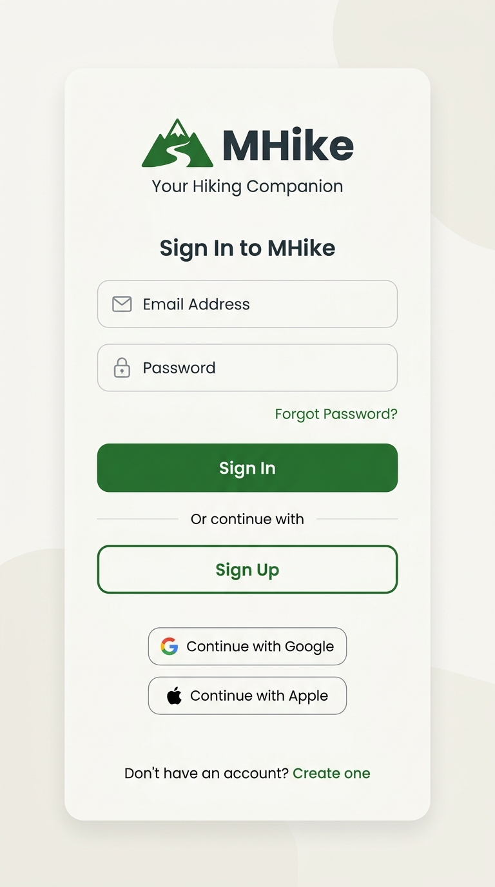
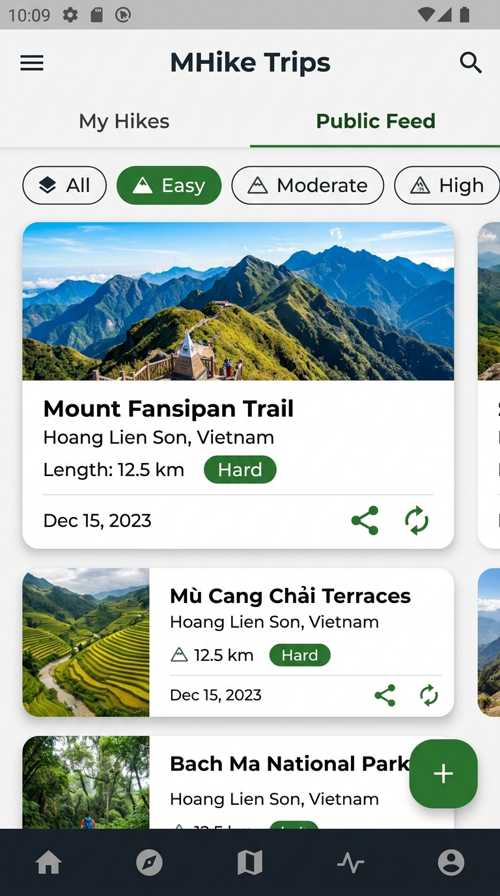
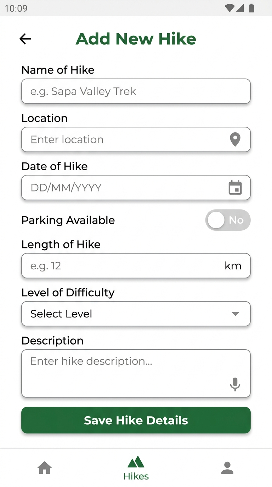
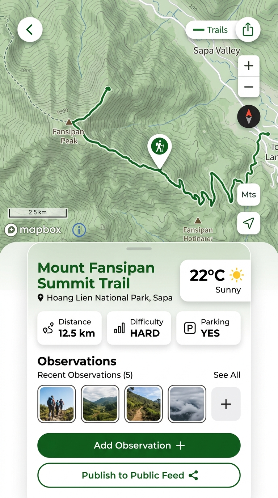

# MHike App - UI Layout Mockups

Dưới đây là bộ bản vẽ Mockup giao diện UI hoàn chỉnh cho ứng dụng **MHike** dựa trên các màn hình ứng dụng:

---

## 1. Màn hình Đăng nhập (Login Screen)

Giao diện đăng nhập hiện đại với logo thương hiệu MHike, các trường nhập liệu chuẩn, nút bấm tông màu xanh lá (Forest Green `#2E7D32`) hỗ trợ cả Đăng nhập & Đăng ký, hiển thị popup thông báo lỗi khi đăng nhập thất bại hoặc để trống.

---

## 2. Màn hình Danh sách Chuyến đi & Public Feed (Hike List Screen)

Giao diện danh sách các chuyến đi bộ với thiết kế dạng Card trực quan, hình ảnh minh họa thiên nhiên, các thẻ lọc độ khó (Easy, Moderate, Hard) và nút chia sẻ Online.

---

## 3. Màn hình Thêm Chuyến đi mới (Add Hike Screen)

Form nhập liệu thông tin chuyến đi với giao diện rõ ràng, hỗ trợ nút bấm thu âm giọng nói (Speech-to-Text) giúp người dùng nhập nhanh mô tả.

---

## 4. Màn hình Chi tiết Chuyến đi & Bản đồ (Hike Detail & Map Screen)

Màn hình hiển thị bản đồ trực quan với đường đi bộ (Mapbox/Google Maps), thông tin thời tiết tự động theo vị trí, danh sách ảnh quan sát (Observations) và nút Publish lên Feed công cộng.

